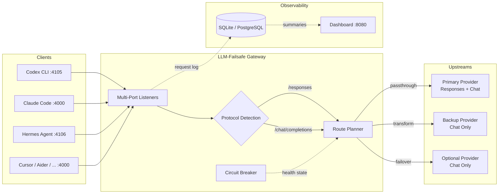

<div align="center">

# LLM-Failsafe

**Failover. Speed. Multi-model blending. One stable endpoint for AI coding tools.**

[](https://github.com/huayintianlai/LLM-Failsafe/actions/workflows/ci.yml)
[](LICENSE)
[](https://nodejs.org/)
[](#docker)
[](CONTRIBUTING.md)

[English](#why-llm-failsafe) · [中文](README.zh-CN.md) · [Documentation](#documentation) · [Contributing](CONTRIBUTING.md) · [Roadmap](ROADMAP.md)

</div>

---

LLM-Failsafe is a local gateway between your AI coding tools and upstream LLM providers. It does three things:

| | | |
|---|---|---|
| **Failover** | Automatic fallback when providers fail — circuit breakers, health tracking, and protocol adaptation keep your tools running without manual intervention. |
| **Faster routing** | Latency-first routing sends each request to the fastest available upstream, cutting response times without sacrificing reliability. |
| **Multi-model blending** | Mix providers and models behind one endpoint. Primary traffic hits your fastest model; overflow and fallback hit cheaper or different ones — downstream clients get a smooth, fast experience without knowing the topology. |

> **Project Status** — LLM-Failsafe is maintained as developer infrastructure, not a one-off proxy script. The repository includes automated tests, Docker and local deployment paths, issue templates for upstream compatibility reports, a release checklist, security guidance, and a public roadmap.

## Why LLM-Failsafe

AI coding tools speak OpenAI-compatible APIs, but real-world providers differ in uptime, latency, Responses API support, streaming semantics, model aliases, and failure modes. LLM-Failsafe sits in that gap: it gives local clients a stable contract while isolating provider-specific behavior behind capability declarations, routing policy, and observability.

### Key Features

| Feature | Description |
|---|---|
| **Failover & Circuit Breaker** | Automatic fallback with exponential backoff, passive health tracking, and protocol adaptation (Responses ↔ Chat Completions) |
| **Latency-first routing** | Each request is routed to the fastest available upstream — configurable per port as `latency-first`, `cost-first`, or `balanced` |
| **Multi-model blending** | Run multiple providers and models behind one endpoint; mix fast + cheap + high-capability models for different traffic |
| **Codex CLI native** | Dedicated `/responses` API listener on port `4105` with bearer-token auth |
| **Multi-app gateway** | Independent ports and routing strategies per client tool |
| **Real-time dashboard** | Token tracking, cost accounting, trend charts, upstream health, and per-app breakdown |
| **Local-first** | Node.js, Docker Compose, macOS launchd — no cloud dependency |

## Quick Start

```bash
git clone https://github.com/huayintianlai/LLM-Failsafe.git
cd LLM-Failsafe
cp .env.example .env
npm ci
```

Edit `.env` and `config/gateway.yaml` for your OpenAI-compatible upstreams:

```bash
UPSTREAM_PRIMARY_API_KEY=replace-with-primary-upstream-key
UPSTREAM_BACKUP_API_KEY=replace-with-backup-upstream-key
```

Start the gateway:

```bash
./scripts/start-gateway.sh
./scripts/health-check.sh
```

Open the dashboard:

```bash
open http://localhost:8080
```

## Dashboard & Usage Observability

LLM-Failsafe ships with a **real-time web dashboard** for day-to-day operations and cost management. When multiple AI tools share the same upstream budget, the dashboard shows exactly which app, model, route, or provider is driving traffic.

<div align="center">


</div>

### What the Dashboard Shows

<table>
<tr>
<td width="50%">

**Overview Metrics**
- Gateway health status (Healthy / Degraded / Attention)
- Total requests, success rate, average latency
- Total tokens consumed (prompt + completion split)
- Estimated cost in USD

</td>
<td width="50%">

**Trend Charts**
- Request volume trend with sparkline visualization
- Token usage trend over time
- Cost movement trend over time
- Configurable time windows: 1h / 24h / 7d

</td>
</tr>
<tr>
<td width="50%">

**Per-App Consumption**
- Token usage breakdown by client app
- Cost allocation per app
- Request count and share percentage
- Visual progress bars for token share

</td>
<td width="50%">

**Upstream Health**
- Circuit breaker state (Closed / Open / Half-open)
- Cooldown timers and consecutive failure count
- Per-upstream latency, token usage, and cost
- Last error details for failed requests

</td>
</tr>
</table>

### Request History & Filtering

The dashboard includes a full **request log** with filtering by:
- **Status** — All requests or failed-only
- **App** — Filter by client application (codex-cli, app-a, etc.)
- **Upstream** — Filter by provider
- **Route mode** — Passthrough vs Transform

Each request row shows timestamp, model, protocol, port, upstream, token count, cost, latency, and status.

## Docker

```bash
cp .env.example .env
docker compose up -d --build
docker compose logs -f gateway
```

The Docker build excludes local `.env`, databases, logs, and runtime state. Secrets are injected at runtime through Compose.

## Compatible Clients

LLM-Failsafe works with **any tool that speaks OpenAI-compatible APIs**. Each client can be assigned a dedicated port with its own routing strategy, so you get independent failover, cost tracking, and observability per tool.

| Client | Protocol | Example Port | Configuration |
|---|---|---|---|
| **Codex CLI** | `/responses` | `4105` | [See below](#codex-cli) |
| **Claude Code** | `/chat/completions` | `4000` | Configure as an OpenAI-compatible endpoint |
| **OpenClaw Hermes** | `/chat/completions` | `4106` | Use a dedicated listener for agent traffic |
| **Cursor** | `/chat/completions` | `4000` | Set base URL to `http://127.0.0.1:4000/v1` |
| **Continue** | `/chat/completions` | `4000` | Set base URL to `http://127.0.0.1:4000/v1` |
| **Aider** | `/chat/completions` | `4000` | `--openai-api-base http://127.0.0.1:4000/v1` |
| **Any OpenAI-compatible tool** | Either | `4000` | Point to `http://127.0.0.1:4000` |

> Each port can have its own `routing_strategy` (`latency-first`, `cost-first`, `balanced`), so latency-sensitive tools like Codex CLI can prioritize speed while batch tools prioritize cost.

### Codex CLI

Use the dedicated Responses API listener:

```toml
[model_providers.llmfailsafe]
name = "llmfailsafe"
base_url = "http://127.0.0.1:4105"
wire_api = "responses"
requires_openai_auth = true
experimental_bearer_token = "local-test-token"
```

### OpenAI-Compatible Clients

For tools that support a custom OpenAI-compatible endpoint, point the client to:

```text
Base URL: http://127.0.0.1:4000/v1
API key: any local placeholder accepted by your listener policy
```

For long-running agents or cost-sensitive workflows, create a dedicated listener and assign a route strategy such as `cost-first`.

### Custom Client Ports

Add a new listener in `config/gateway.yaml` for any tool that needs its own routing strategy:

```yaml
ports:
  - port: 4108
    app_name: my-tool
    description: Custom port for my-tool
    routing_strategy: balanced
```

## Ports

| Port | Default app | Purpose |
|---|---|---|
| `4105` | `codex-cli` | Responses API traffic for Codex CLI |
| `4106` | `app-a` | Example cost-first application route |
| `4107` | `app-b` | Example balanced application route |
| `4000` | `default` | Generic OpenAI-compatible endpoint |
| `8080` | dashboard | Web dashboard |

## Architecture



## Configuration Model

Each upstream declares its origin, API key, supported models, protocol capabilities (Responses API / Chat Completions), routing priority, and cost metadata. The routing strategy is configured per listener port.

```yaml
# Example: per-port routing strategy
ports:
  - port: 4105
    app_name: codex-cli
    routing_strategy: latency-first
  - port: 4106
    app_name: app-a
    routing_strategy: cost-first

# Example: upstream capability declaration
upstreams:
  - id: primary
    capabilities:
      supports_responses: true
      supports_chat_completions: true
    cost:
      per_1k_prompt: 0.01
      per_1k_completion: 0.03
```

The default `config/gateway.yaml` uses placeholder providers. Replace them with providers you are authorized to use.

## Testing

```bash
npm test                          # unit + integration + failover + performance
npm run test:unit                 # unit tests only
npm run test:integration          # integration tests only
npm run test:failover             # failover scenario tests
npm run test:performance          # performance benchmarks
```

Optional acceptance scripts for live deployments:

```bash
./scripts/acceptance-suite.sh     # full acceptance suite
./scripts/acceptance-codex.sh     # Codex CLI specific tests
```

## Documentation

| Document | Description |
|---|---|
| [Ecosystem Position](docs/ECOSYSTEM.md) | Project role in the AI coding tools ecosystem |
| [Compatibility Matrix](docs/COMPATIBILITY_MATRIX.md) | Client, protocol, provider, and observability coverage |
| [Maintainer Guide](docs/MAINTAINER_GUIDE.md) | Review, triage, compatibility, and release practices |
| [Deployment Guide](docs/DEPLOYMENT.md) | Node.js, Docker, macOS launchd setup |
| [Operations Checklist](docs/OPERATIONS.md) | Day-to-day operational tasks |
| [Technical Spec](docs/spec.md) | Protocol and routing specification |
| [Architecture](ARCHITECTURE.md) | Design decisions and data flow |
| [Roadmap](ROADMAP.md) | Planned features and priorities |
| [Security](SECURITY.md) | Vulnerability reporting and key handling |
| [Contributing](CONTRIBUTING.md) | How to contribute |

## Security

Never commit real API keys, bearer tokens, local databases, logs, or runtime state. Use `.env` for local secrets and see [SECURITY.md](SECURITY.md) for vulnerability reporting.

## License

Apache-2.0
