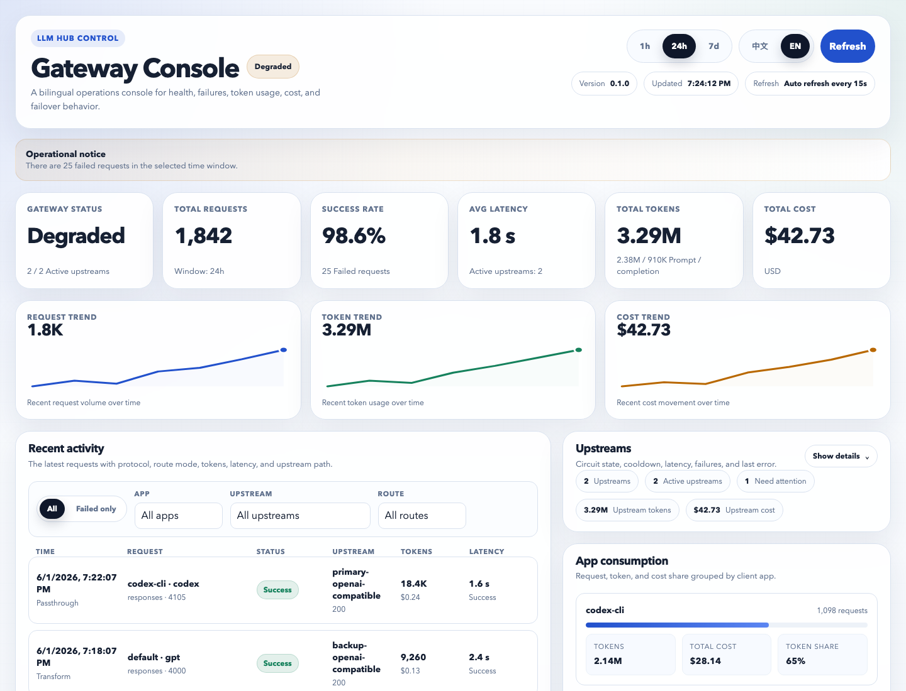

# LLM-Hub

OpenAI-compatible local LLM gateway for Codex CLI, multi-upstream failover, protocol adaptation, and usage observability.

LLM-Hub gives local AI tools one stable endpoint while it routes requests across multiple upstream providers. It supports both `/responses` and `/chat/completions`, can pass through native Responses API traffic when a provider supports it, and can transform Responses requests to Chat Completions when failover needs a compatible backup.

[中文](#中文) | [Documentation](#documentation) | [Contributing](CONTRIBUTING.md) | [Security](SECURITY.md)

## Project Status

LLM-Hub is maintained as developer infrastructure, not a one-off proxy script. The repository includes automated tests, Docker and local deployment paths, issue templates for upstream compatibility reports, a release checklist, security guidance, and a public roadmap. The current focus is compatibility, operational safety, and clear provider-neutral configuration.

## Ecosystem Role

AI coding tools increasingly speak OpenAI-compatible APIs, but real-world providers differ in their support for Responses API, Chat Completions, streaming behavior, model aliases, usage metadata, and failure modes. LLM-Hub sits in that gap: it gives local clients a stable contract while isolating provider-specific behavior behind capability declarations, routing policy, and observability.

This makes it useful as a small infrastructure layer for developers who run Codex CLI or several AI tools locally and need reliability across upstream providers without baking provider quirks into every client.

## Why LLM-Hub

- **One local gateway for many AI apps**: dedicated ports for Codex CLI, app-specific traffic, and generic OpenAI-compatible clients.
- **Codex CLI support**: native `/responses` listener with bearer-token auth on port `4105`.
- **Multi-upstream failover**: priority routing, dynamic routing, passive health tracking, and circuit breaker cooldowns.
- **Protocol adaptation**: passthrough for native Responses API providers; transform mode for Chat Completions-only backups.
- **Usage observability**: dashboard, request history, token/cost accounting, SQLite/PostgreSQL storage, and upstream health state.
- **Local-first deployment**: Node.js, Docker Compose, macOS launchd templates, and lifecycle scripts.
- **Maintenance workflow**: CI, issue templates, contribution guidance, release checklist, and a roadmap for compatibility work.

## Quick Start

```bash
git clone https://github.com/huayintianlai/LLM-Hub.git
cd LLM-Hub
cp .env.example .env
npm ci
```

Edit `.env` and `config/gateway.yaml` for your OpenAI-compatible upstreams:

```bash
UPSTREAM_PRIMARY_API_KEY=replace-with-primary-upstream-key
UPSTREAM_BACKUP_API_KEY=replace-with-backup-upstream-key
```

Start the gateway:

```bash
./scripts/start-gateway.sh
./scripts/health-check.sh
```

Open the dashboard:

```bash
open http://localhost:8080
```

## Dashboard & Usage Observability

LLM-Hub ships with a web dashboard for day-to-day operations. It surfaces gateway health, recent failures, request volume, token usage, estimated cost, upstream circuit state, latency, and per-app consumption. This is useful when several local tools share the same upstream budget and you need to see which app, model, route, or provider is driving traffic.



## Docker

```bash
cp .env.example .env
docker compose up -d --build
docker compose logs -f gateway
```

The Docker build excludes local `.env`, databases, logs, and runtime state. Secrets are injected at runtime through Compose.

## Codex CLI

Use the dedicated Responses API listener:

```toml
[model_providers.llmhub]
name = "llmhub"
base_url = "http://127.0.0.1:4105"
wire_api = "responses"
requires_openai_auth = true
experimental_bearer_token = "local-test-token"
```

Then map your Codex model alias in `config/gateway.yaml`, for example:

```yaml
model_aliases:
  codex: codex-model
```

## Ports

| Port | Default app | Purpose |
| --- | --- | --- |
| `4105` | `codex-cli` | Responses API traffic for Codex CLI |
| `4106` | `app-a` | Example cost-first application route |
| `4107` | `app-b` | Example balanced application route |
| `4000` | `default` | Generic OpenAI-compatible endpoint |
| `8080` | dashboard | Web dashboard |

## Configuration Model

Each upstream declares:

- `origin` and endpoint paths
- API key environment variable
- supported models and aliases
- protocol capabilities, including Responses API and Chat Completions support
- routing priority and cost metadata

The default `config/gateway.yaml` uses placeholder providers such as `primary-openai-compatible` and `backup-openai-compatible`. Replace them with providers you are authorized to use.

## Testing

```bash
npm test
```

Optional acceptance scripts are available for local deployments:

```bash
./scripts/acceptance-suite.sh
./scripts/acceptance-codex.sh
```

Some acceptance scripts require real upstream credentials and a running gateway.

## Maintenance

The project treats upstream compatibility as a first-class maintenance surface. If a provider behaves differently from the OpenAI-compatible contract, please open an upstream compatibility report with redacted request/response details. Changes that affect routing, protocol conversion, failover, persistence, or dashboard behavior should include tests.

## Documentation

- [Deployment guide](docs/DEPLOYMENT.md)
- [Operations checklist](docs/OPERATIONS.md)
- [Technical spec](docs/spec.md)
- [Architecture notes](ARCHITECTURE.md)
- [Roadmap](ROADMAP.md)

## Security

Never commit real API keys, bearer tokens, local databases, logs, or runtime state. Use `.env` for local secrets and see [SECURITY.md](SECURITY.md) for vulnerability reporting.

## License

Apache-2.0

---

## 中文

LLM-Hub 是一个本地 OpenAI-compatible LLM 网关，面向 Codex CLI、多上游故障转移、协议适配和用量可观测性。

它让本地 AI 工具只连接一个稳定入口，然后由网关把请求路由到多个上游。项目同时支持 `/responses` 和 `/chat/completions`：如果上游原生支持 Responses API，就直通；如果备用上游只支持 Chat Completions，就在故障转移时自动转换协议。

## 项目状态

LLM-Hub 按开发者基础设施来维护，而不是一次性的代理脚本。仓库包含自动化测试、Docker 和本地部署路径、上游兼容性 issue 模板、release checklist、安全说明和公开路线图。当前重点是兼容性、运维安全和 provider-neutral 的清晰配置。

## 生态位

越来越多 AI 编程工具使用 OpenAI-compatible API，但真实上游在 Responses API、Chat Completions、流式行为、模型别名、usage 元数据和失败模式上并不完全一致。LLM-Hub 处在这个缝隙里：它给本地客户端一个稳定契约，把上游差异收敛到能力声明、路由策略和可观测性里。

这让它适合作为一个小型基础设施层，服务于重度使用 Codex CLI 或多个本地 AI 工具、并且需要跨上游可靠性的开发者。

## 核心价值

- **多个 AI 应用共用一个本地网关**：Codex CLI、其他编码工具和普通 OpenAI-compatible 客户端都可以接入。
- **Codex CLI 友好**：`4105` 端口提供 `/responses` API，并支持 Bearer token。
- **多上游容灾**：优先级路由、动态路由、被动健康监控和熔断器冷却。
- **协议适配**：支持 Responses API 直通，也支持 Responses 到 Chat Completions 的转换。
- **可观测性**：Web dashboard、请求历史、token/成本统计、SQLite/PostgreSQL 存储、上游健康状态。
- **本地优先部署**：Node.js、Docker Compose、macOS launchd 和生命周期脚本。
- **维护流程**：CI、issue 模板、贡献指南、release checklist，以及面向兼容性工作的路线图。

## 快速开始

```bash
git clone https://github.com/huayintianlai/LLM-Hub.git
cd LLM-Hub
cp .env.example .env
npm ci
```

编辑 `.env` 和 `config/gateway.yaml`，填入你自己的 OpenAI-compatible 上游：

```bash
UPSTREAM_PRIMARY_API_KEY=replace-with-primary-upstream-key
UPSTREAM_BACKUP_API_KEY=replace-with-backup-upstream-key
```

启动并检查：

```bash
./scripts/start-gateway.sh
./scripts/health-check.sh
open http://localhost:8080
```

## Dashboard 和用量可观测性

LLM-Hub 自带 Web dashboard，用于日常运维和用量分析。它会展示网关健康状态、最近失败、请求量、Token 用量、预估成本、上游熔断状态、延迟，以及按应用聚合的消耗。当多个本地 AI 工具共用同一组上游预算时，可以很快看出是哪一个应用、模型、路由或 provider 在产生流量。


## Docker 部署

```bash
cp .env.example .env
docker compose up -d --build
docker compose logs -f gateway
```

Docker 构建上下文会排除本地 `.env`、数据库、日志和运行态目录；密钥只在运行时注入。

## Codex CLI 配置

```toml
[model_providers.llmhub]
name = "llmhub"
base_url = "http://127.0.0.1:4105"
wire_api = "responses"
requires_openai_auth = true
experimental_bearer_token = "local-test-token"
```

然后在 `config/gateway.yaml` 中把你的 Codex 模型映射到 `codex` alias。

## 端口

| 端口 | 默认应用 | 用途 |
| --- | --- | --- |
| `4105` | `codex-cli` | Codex CLI 的 Responses API 入口 |
| `4106` | `app-a` | 示例：成本优先应用路由 |
| `4107` | `app-b` | 示例：均衡策略应用路由 |
| `4000` | `default` | 通用 OpenAI-compatible 入口 |
| `8080` | dashboard | Web 监控面板 |

## 测试

```bash
npm test
```

## 维护

项目把上游兼容性当作核心维护面。如果某个 provider 的行为和 OpenAI-compatible 契约不同，欢迎提交上游兼容性报告，并附上脱敏后的请求/响应信息。涉及路由、协议转换、故障转移、持久化或 dashboard 行为的变更应补充测试。

## 文档

- [部署指南](docs/DEPLOYMENT.md)
- [运维清单](docs/OPERATIONS.md)
- [技术规格](docs/spec.md)
- [架构说明](ARCHITECTURE.md)
- [路线图](ROADMAP.md)

## 安全

不要提交真实 API key、Bearer token、本地数据库、日志或运行态目录。漏洞报告和密钥处理原则见 [SECURITY.md](SECURITY.md)。
