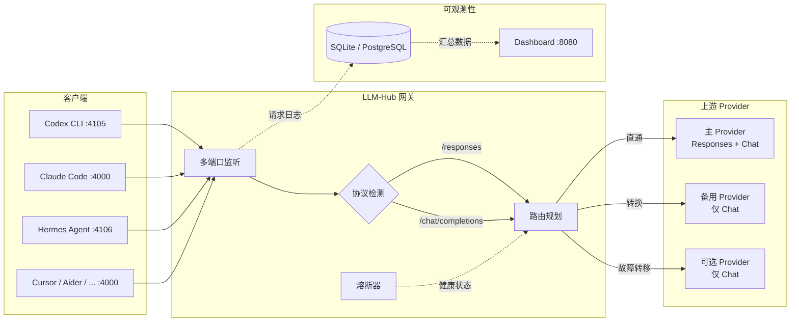

<div align="center">

# LLM-Hub

**面向 Codex CLI 和 OpenAI-compatible AI 编程代理的本地兼容层、故障转移层和用量可观测层**

[](https://github.com/huayintianlai/LLM-Hub/actions/workflows/ci.yml)
[](LICENSE)
[](https://nodejs.org/)
[](#docker-部署)
[](CONTRIBUTING.md)

[English](README.md) · [文档](#文档) · [贡献指南](CONTRIBUTING.md) · [路线图](ROADMAP.md)

</div>

---

LLM-Hub 让本地 AI 编程工具只连接**一个稳定入口**，由网关把请求路由到多个上游。项目同时支持 `/responses` 和 `/chat/completions`：如果上游原生支持 Responses API 就直通；如果备用上游只支持 Chat Completions，就在故障转移时自动转换协议。

> **项目状态** — LLM-Hub 按开发者基础设施来维护，而不是一次性的代理脚本。仓库包含自动化测试、Docker 和本地部署路径、上游兼容性 issue 模板、release checklist、安全说明和公开路线图。

## 为什么选择 LLM-Hub

越来越多 AI 编程工具使用 OpenAI-compatible API，但真实上游在 Responses API、Chat Completions、流式行为、模型别名、usage 元数据和失败模式上并不完全一致。LLM-Hub 处在这个缝隙里：它给本地客户端一个稳定契约，把上游差异收敛到能力声明、路由策略和可观测性里。

### 核心能力

| 能力 | 说明 |
|---|---|
| **多应用网关** | 为 Codex CLI、不同应用、通用客户端提供独立端口和路由策略 |
| **Codex CLI 原生支持** | `4105` 端口提供 `/responses` API + Bearer token 认证 |
| **智能故障转移** | 优先级路由、动态路由、被动健康监控、指数退避熔断器 |
| **协议自动适配** | Responses API 直通；故障转移时自动转换为 Chat Completions |
| **用量可观测性** | 实时 Dashboard：Token 趋势图、成本趋势、按应用消耗分析 |
| **路由策略** | `latency-first`、`cost-first`、`balanced` — 按端口独立配置 |
| **本地优先** | Node.js、Docker Compose、macOS launchd 模板和生命周期脚本 |
| **双语 Dashboard** | 中英文一键切换 |

## 快速开始

```bash
git clone https://github.com/huayintianlai/LLM-Hub.git
cd LLM-Hub
cp .env.example .env
npm ci
```

编辑 `.env` 和 `config/gateway.yaml`，填入你自己的 OpenAI-compatible 上游：

```bash
UPSTREAM_PRIMARY_API_KEY=replace-with-primary-upstream-key
UPSTREAM_BACKUP_API_KEY=replace-with-backup-upstream-key
```

启动并检查：

```bash
./scripts/start-gateway.sh
./scripts/health-check.sh
open http://localhost:8080
```

## Dashboard 用量可观测性

LLM-Hub 自带**实时 Web Dashboard**，用于日常运维和成本管理。当多个本地 AI 工具共用同一组上游预算时，可以很快看出是哪一个应用、模型、路由或 provider 在产生流量。

<div align="center">


</div>

### Dashboard 功能一览

<table>
<tr>
<td width="50%">

**概览指标**
- 网关健康状态（健康 / 降级 / 需关注）
- 请求总数、成功率、平均延迟
- Token 总量（输入 + 输出拆分）
- 预估成本（USD）

</td>
<td width="50%">

**趋势图表**
- 请求量趋势 Sparkline 可视化
- Token 用量趋势
- 成本变动趋势
- 可选时间窗口：1h / 24h / 7d

</td>
</tr>
<tr>
<td width="50%">

**应用维度消耗**
- 按客户端应用分组的 Token 用量
- 成本分配
- 请求数和占比
- Token 占比进度条

</td>
<td width="50%">

**上游健康**
- 熔断器状态（关闭 / 打开 / 半开）
- 冷却倒计时和连续失败次数
- 按上游的延迟、Token 用量和成本
- 失败请求的错误详情

</td>
</tr>
</table>

### 请求历史与筛选

Dashboard 包含完整的**请求日志**，支持按以下维度筛选：
- **状态** — 全部请求或仅失败
- **应用** — 按客户端应用（codex-cli、app-a 等）
- **上游** — 按 provider
- **路由模式** — 直通 vs 转换

每条请求记录展示时间戳、模型、协议、端口、上游、Token 数量、成本、延迟和状态。

## Docker 部署

```bash
cp .env.example .env
docker compose up -d --build
docker compose logs -f gateway
```

Docker 构建上下文会排除本地 `.env`、数据库、日志和运行态目录；密钥只在运行时注入。

## 兼容客户端

LLM-Hub 支持**任何使用 OpenAI-compatible API 的工具**。每个客户端可以分配独立端口和路由策略，实现独立的故障转移、成本追踪和可观测性。

| 客户端 | 协议 | 示例端口 | 配置方式 |
|---|---|---|---|
| **Codex CLI** | `/responses` | `4105` | [见下方](#codex-cli-配置) |
| **Claude Code** | `/chat/completions` | `4000` | 按 OpenAI-compatible endpoint 配置 |
| **OpenClaw Hermes** | `/chat/completions` | `4106` | 为 agent 流量配置独立监听端口 |
| **Cursor** | `/chat/completions` | `4000` | Base URL 设为 `http://127.0.0.1:4000/v1` |
| **Continue** | `/chat/completions` | `4000` | Base URL 设为 `http://127.0.0.1:4000/v1` |
| **Aider** | `/chat/completions` | `4000` | `--openai-api-base http://127.0.0.1:4000/v1` |
| **任何 OpenAI-compatible 工具** | 均可 | `4000` | 指向 `http://127.0.0.1:4000` |

> 每个端口可配置独立的 `routing_strategy`（`latency-first`、`cost-first`、`balanced`），延迟敏感的工具（如 Codex CLI）可以优先速度，批量工具可以优先成本。

### Codex CLI 配置

```toml
[model_providers.llmhub]
name = "llmhub"
base_url = "http://127.0.0.1:4105"
wire_api = "responses"
requires_openai_auth = true
experimental_bearer_token = "local-test-token"
```

### OpenAI-compatible 客户端配置

对于支持自定义 OpenAI-compatible endpoint 的工具，将客户端指向：

```text
Base URL: http://127.0.0.1:4000/v1
API key: 任意符合本地监听策略的占位 token
```

对于长时间运行的 agent 或成本敏感工作流，可以配置独立监听端口，并使用 `cost-first` 等路由策略。

### 自定义客户端端口

在 `config/gateway.yaml` 中为任何工具添加独立监听端口：

```yaml
ports:
  - port: 4108
    app_name: my-tool
    description: 自定义工具端口
    routing_strategy: balanced
```

## 端口

| 端口 | 默认应用 | 用途 |
|---|---|---|
| `4105` | `codex-cli` | Codex CLI 的 Responses API 入口 |
| `4106` | `app-a` | 示例：成本优先应用路由 |
| `4107` | `app-b` | 示例：均衡策略应用路由 |
| `4000` | `default` | 通用 OpenAI-compatible 入口 |
| `8080` | dashboard | Web 监控面板 |

## 架构



## 配置模型

每个上游声明其 origin、API key、支持的模型、协议能力（Responses API / Chat Completions）、路由优先级和成本元数据。路由策略按监听端口独立配置。

```yaml
# 示例：按端口配置路由策略
ports:
  - port: 4105
    app_name: codex-cli
    routing_strategy: latency-first
  - port: 4106
    app_name: app-a
    routing_strategy: cost-first

# 示例：上游能力声明
upstreams:
  - id: primary
    capabilities:
      supports_responses: true
      supports_chat_completions: true
    cost:
      per_1k_prompt: 0.01
      per_1k_completion: 0.03
```

## 测试

```bash
npm test                          # 全部测试
npm run test:unit                 # 单元测试
npm run test:integration          # 集成测试
npm run test:failover             # 故障转移场景测试
npm run test:performance          # 性能基准测试
```

可选的验收脚本（需要真实上游凭证和运行中的网关）：

```bash
./scripts/acceptance-suite.sh     # 完整验收套件
./scripts/acceptance-codex.sh     # Codex CLI 专项测试
```

## 文档

| 文档 | 说明 |
|---|---|
| [生态定位](docs/ECOSYSTEM.md) | 项目在 AI 编程工具生态中的角色 |
| [兼容矩阵](docs/COMPATIBILITY_MATRIX.md) | 客户端、协议、上游和可观测性覆盖 |
| [维护者指南](docs/MAINTAINER_GUIDE.md) | Review、triage、兼容性和发布实践 |
| [部署指南](docs/DEPLOYMENT.md) | Node.js、Docker、macOS launchd 部署 |
| [运维清单](docs/OPERATIONS.md) | 日常运维任务 |
| [技术规格](docs/spec.md) | 协议和路由规格 |
| [架构说明](ARCHITECTURE.md) | 设计决策和数据流 |
| [路线图](ROADMAP.md) | 规划中的功能和优先级 |
| [安全说明](SECURITY.md) | 漏洞报告和密钥处理 |
| [贡献指南](CONTRIBUTING.md) | 如何参与贡献 |

## 安全

不要提交真实 API key、Bearer token、本地数据库、日志或运行态目录。漏洞报告和密钥处理原则见 [SECURITY.md](SECURITY.md)。

## 许可证

Apache-2.0
